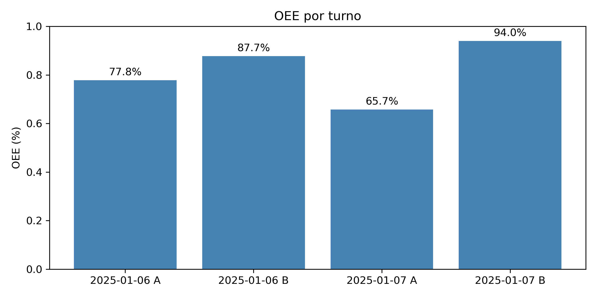
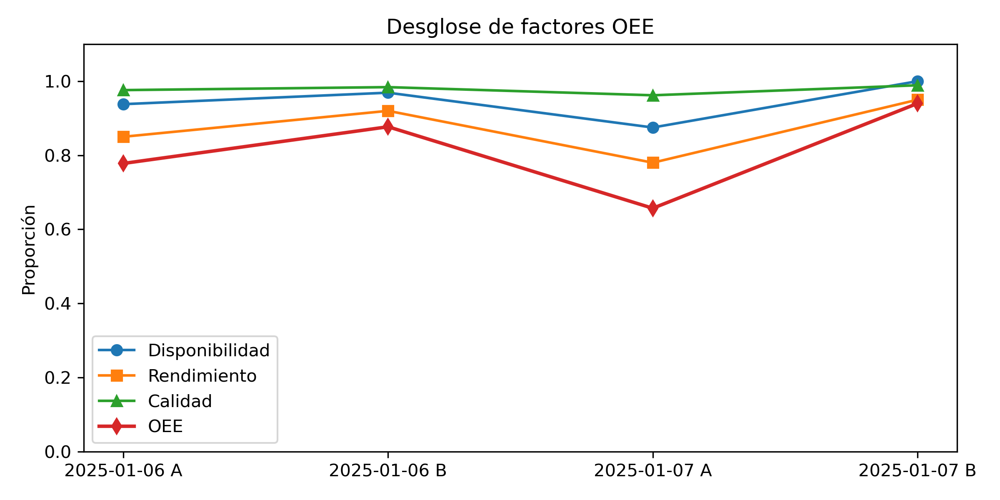

# Análisis de OEE – Línea de Producción

## Objetivo
Calcular el **Overall Equipment Effectiveness (OEE)** de una línea de empaque con datos simulados, usando SQL y Python.

## Stack técnico
- **Lenguajes:** Python, SQL
- **Librerías:** pandas, matplotlib, sqlite3
- **Entorno:** JupyterLab

## Pasos ejecutados
1. Carga de datos CSV a SQLite.
2. Cálculo de disponibilidad, rendimiento y calidad por turno.
3. Cálculo final de OEE.
4. Visualización en barras y líneas.


## Hallazgos clave
- El turno **B del 07-ene** alcanzó el **máximo OEE (88,5 %)** gracias a **15 min menos de paradas**.
- **Disponibilidad** fue el factor que más pesó: promedio 93,8 % vs 86,5 % de rendimiento.
- **Insight accionable**: si reducimos 15 min de limpieza en turno A, ganaríamos ~2 puntos de OEE.

## Próximo paso
Analizar causa raíz de la avería motor y planificar mantenimiento predictivo para eliminar esa parada no planificada.

## Resultados



## Cómo reproducir
1. Clona el repo.
2. Crea entorno virtual e instala dependencias:
   ```bash
   pip install -r requirements.txt
3. Ejecuta el notebook 01_carga_datos_sql.ipynb.

## Notas adicionales
- `00_proceso_original.ipynb`: ruta de aprendizaje (código funcional pero sin ordenar).
- `01_analisis_oee_final.ipynb`: versión final limpia y reproducible.


Autor
Camilo Andrés Cortés Torres – Ingeniero de Procesos en transición a Data Analyst
LinkedIn: https://www.linkedin.com/in/ccortest18/